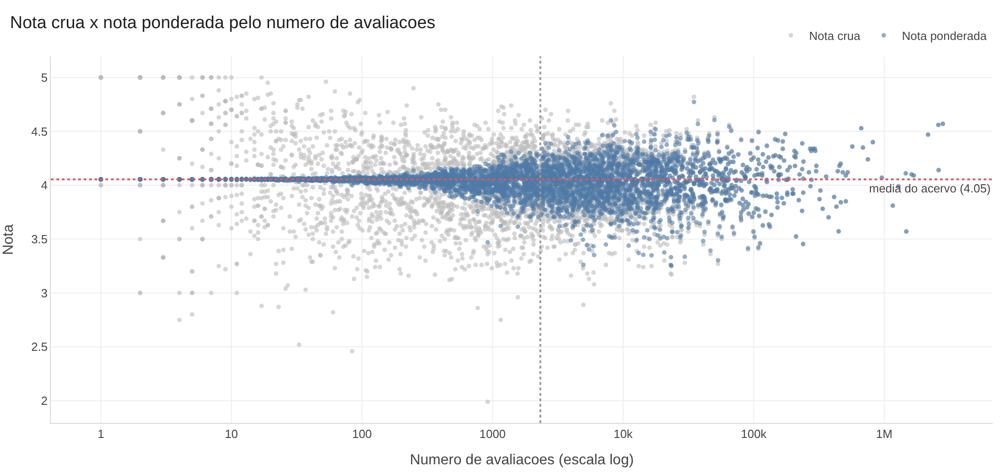
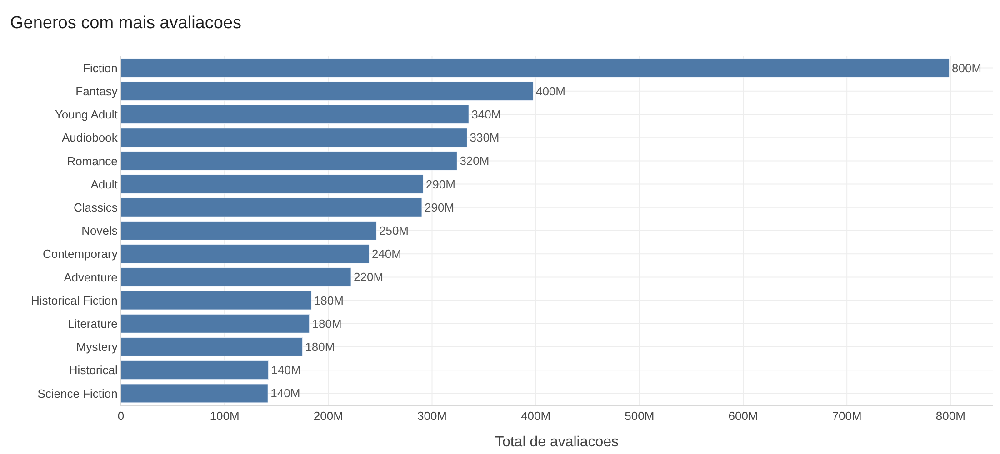
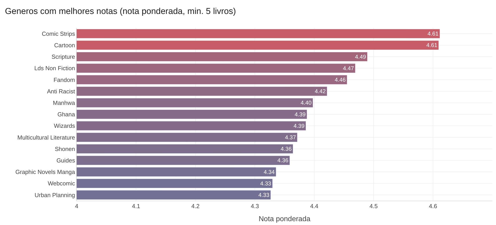
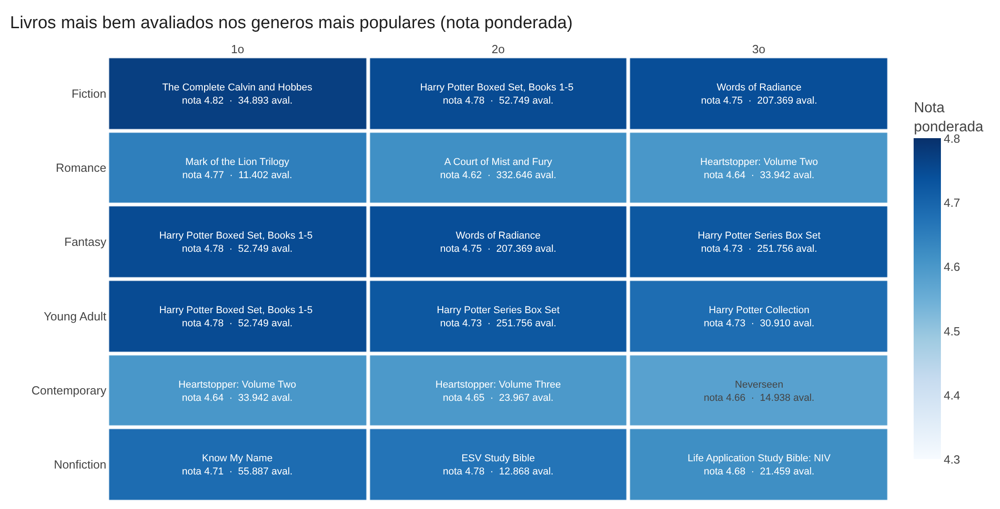
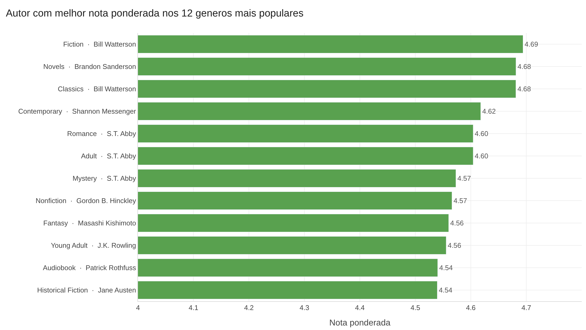
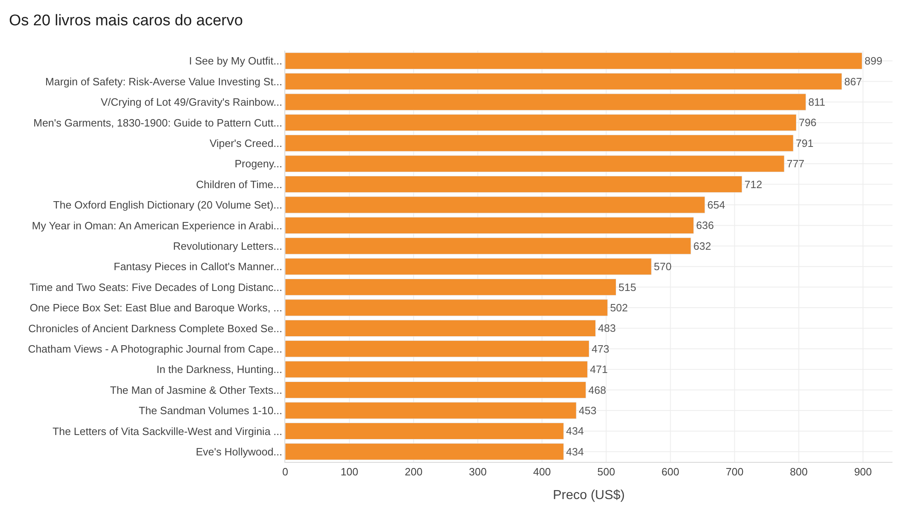
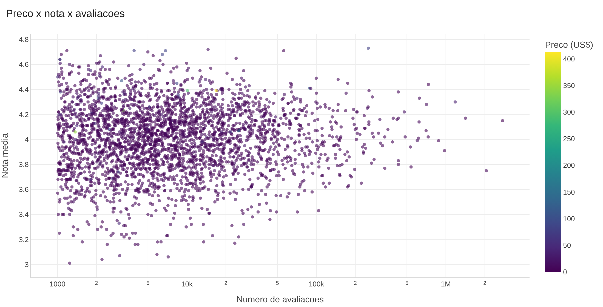

# Rating Books

Análise de um acervo de **52.478 livros** raspados do Goodreads (25 colunas, ~74 MB). O notebook
responde a quatro perguntas sobre gêneros, notas, autores e preços — e mostra o caminho até cada
resposta.

## As perguntas

1. Quais gêneros têm mais avaliações no total e melhores notas médias?
2. Quais livros são os mais bem avaliados dentro de cada gênero?
3. Quais autores se destacam (melhor nota média) dentro de cada gênero?
4. Quais os livros são mais caros?

## Como rodar

```bash
pip install -r requirements.txt
jupyter lab analise.ipynb
```

O notebook já vem executado, com as tabelas e gráficos salvos. Para gerar as imagens usadas neste
README, rode todas as células — os PNGs são escritos em `images/`.

## Estrutura

```
analise.ipynb                      análise completa, passo a passo
analise.py                         versão em script (matplotlib) da mesma análise
books_1.Best_Books_Ever.csv        base bruta (Goodreads)
images/                            gráficos exportados, usados abaixo
requirements.txt
```

## Como as notas são comparadas: nota ponderada

A nota que vem no Goodreads é a média das estrelas de cada livro, mas ela ignora **quantas pessoas**
avaliaram. Ranqueando por ela, o topo era ocupado por livros com 2, 4 ou 7 avaliações nota 5,0 —
à frente de obras avaliadas por centenas de milhares de leitores. Dos livros com menos de 10
avaliações, **1.343 têm nota 4,5 ou mais**.

Por isso, todos os rankings de nota usam a **média bayesiana** (a mesma ideia do Top 250 do IMDb):

```
nota ponderada = (v × R + m × C) / (v + m)
```

- `R` é a nota do livro e `v` o número de avaliações dele;
- `C` é a nota média do acervo, ponderada pelas avaliações (**4,05**);
- `m` é a mediana de avaliações por livro (**2.322**).

Um livro com poucas avaliações fica perto da média geral, porque ainda não provou nada; um livro com
centenas de milhares fica praticamente com a própria nota. Para gêneros e autores, a fórmula usa a
soma das avaliações e dos pontos (`R × v`) de todos os livros do grupo.



Em cinza, a nota crua de cada livro; em azul, a nota ponderada. À esquerda, onde há poucas
avaliações, as notas cruas se espalham de 1 a 5 e a ponderada as puxa para a média. À direita, as
duas coincidem.

Antes de calcular, removo **54 linhas repetidas** (mesmo `bookId`) e deixo os **71 livros sem
nenhuma avaliação** fora das médias — a nota deles vinha como 0.

## Resultados

### 1. Gêneros com mais avaliações e melhores notas

Fiction, Fantasy e Young Adult lideram em volume. Como cada livro entra, em média, em **7,8
gêneros**, esses gêneros acabam se sobrepondo.



| gênero | avaliações | nota ponderada | livros |
| --- | ---: | ---: | ---: |
| Fiction | 798.573.850 | 4,047 | 30.081 |
| Fantasy | 397.479.523 | 4,104 | 14.328 |
| Young Adult | 335.370.254 | 4,092 | 11.362 |
| Audiobook | 333.726.811 | 4,091 | 7.204 |
| Romance | 324.048.146 | 4,026 | 14.527 |

Quando o critério passa a ser a **nota ponderada** (com pelo menos 5 livros por gênero), lideram
quadrinhos e tiras: Comic Strips e Cartoon, puxados por *Calvin e Hobbes*. Antes da ponderação, o
primeiro lugar era **Baha I**, com 6 livros e só 1.588 avaliações somadas; agora ele fica perto da
média e sai da lista.



| gênero | nota ponderada | avaliações | livros |
| --- | ---: | ---: | ---: |
| Comic Strips | 4,612 | 716.979 | 59 |
| Cartoon | 4,610 | 367.823 | 37 |
| Scripture | 4,489 | 30.108 | 24 |
| Lds Non Fiction | 4,469 | 161.535 | 29 |
| Fandom | 4,455 | 288.064 | 10 |

### 2. Melhores livros por gênero

Os três livros de maior nota ponderada nos seis gêneros mais populares. Na figura, cada linha é um
gênero, cada coluna é a posição, e a cor é a nota ponderada. Dentro de cada célula estão o título,
a nota original e o número de avaliações.



| gênero | posição | título | nota | avaliações | nota ponderada |
| --- | ---: | --- | ---: | ---: | ---: |
| Fiction | 1º | The Complete Calvin and Hobbes | 4,82 | 34.893 | 4,772 |
| Fiction | 2º | Harry Potter Boxed Set, Books 1-5 | 4,78 | 52.749 | 4,749 |
| Fiction | 3º | Words of Radiance | 4,75 | 207.369 | 4,742 |
| Romance | 1º | Mark of the Lion Trilogy | 4,77 | 11.402 | 4,649 |
| Romance | 2º | A Court of Mist and Fury | 4,62 | 332.646 | 4,616 |
| Romance | 3º | Heartstopper: Volume Two | 4,64 | 33.942 | 4,602 |
| Fantasy | 1º | Harry Potter Boxed Set, Books 1-5 | 4,78 | 52.749 | 4,749 |
| Fantasy | 2º | Words of Radiance | 4,75 | 207.369 | 4,742 |
| Fantasy | 3º | Harry Potter Series Box Set | 4,73 | 251.756 | 4,724 |
| Young Adult | 1º | Harry Potter Boxed Set, Books 1-5 | 4,78 | 52.749 | 4,749 |
| Young Adult | 2º | Harry Potter Series Box Set | 4,73 | 251.756 | 4,724 |
| Young Adult | 3º | Harry Potter Collection | 4,73 | 30.910 | 4,683 |
| Contemporary | 1º | Heartstopper: Volume Two | 4,64 | 33.942 | 4,602 |
| Contemporary | 2º | Heartstopper: Volume Three | 4,65 | 23.967 | 4,597 |
| Contemporary | 3º | Neverseen | 4,66 | 14.938 | 4,578 |
| Nonfiction | 1º | Know My Name | 4,71 | 55.887 | 4,684 |
| Nonfiction | 2º | ESV Study Bible | 4,78 | 12.868 | 4,669 |
| Nonfiction | 3º | Life Application Study Bible: NIV | 4,68 | 21.459 | 4,619 |

Antes, o primeiro lugar em Fiction, Romance e Young Adult era **Battle for Erthia**, com 7
avaliações. Agora todos os livros do topo têm mais de 10 mil avaliações. O que ainda se repete entre
gêneros são as coleções de *Harry Potter*, que recebem muitas tags e notas altas de fãs da série.

### 3. Autores que se destacam por gênero

Para cada um dos 12 gêneros mais populares, o autor com a melhor nota ponderada, exigindo pelo menos
2 livros dele no gênero. Antes, a lista mostrava os 20 maiores recordes em qualquer gênero, e o
topo ficava com **Elias Zapple** e **Kenneth Thomas** — autores com no máximo ~1.100 avaliações
somadas, repetidos em vários gêneros.



Agora aparecem nomes com milhares de leitores: **Bill Watterson** (Calvin e Hobbes), **Brandon
Sanderson**, **J.K. Rowling**, **Jane Austen** e **Patrick Rothfuss**.

### 4. Livros mais caros

A lista é dominada por **box sets e obras de referência** — um dicionário de 20 volumes, coleções
de mangá e guias técnicos. Para comparar, o preço mediano do acervo é de apenas **US$ 5,20**.



| preço | formato | nota | título |
| ---: | --- | ---: | --- |
| US$ 898,64 | Paperback | 4,11 | I See by My Outfit |
| US$ 867,05 | Hardcover | 4,34 | Margin of Safety |
| US$ 811,04 | Hardcover | 4,41 | V/Crying of Lot 49 / Gravity's Rainbow |
| US$ 796,14 | Paperback | 4,42 | Men's Garments, 1830-1900 |
| US$ 653,73 | Hardcover | 4,72 | The Oxford English Dictionary (20 vol.) |

### Extra — preço, nota e popularidade



A nota se concentra entre 3,8 e 4,4 na maior parte do acervo, e o preço não muda muito esse
padrão.

## Onde estes números merecem desconfiança

- **A soma por gênero conta a mesma avaliação várias vezes.** Um livro com 8 gêneros soma suas
  avaliações 8 vezes, e o total fica cerca de 10x maior que o real. Use os valores para comparar
  gêneros entre si, não como contagem de leitores.
- **A nota ponderada depende da escolha de `m`.** Usei a mediana (2.322 avaliações). Um `m` maior
  favorece ainda mais os livros populares; um menor dá mais espaço a livros de nicho.
- **Popularidade não é qualidade.** A ponderação mede a **confiança** na nota: um livro excelente
  e pouco conhecido demora a subir no ranking.
- **Box sets competem com livros avulsos.** Coleções como *Harry Potter Boxed Set* aparecem no topo
  de vários gêneros.
- **O preço compara edições, não obras.** Box set, paperback e ebook do mesmo título entram na
  mesma lista.
- **A cobertura é parcial:** 27,4% do acervo não tem preço, e 81% está em inglês.

## Stack

Python 3 · pandas · plotly · Kaleido (exportação das imagens)
